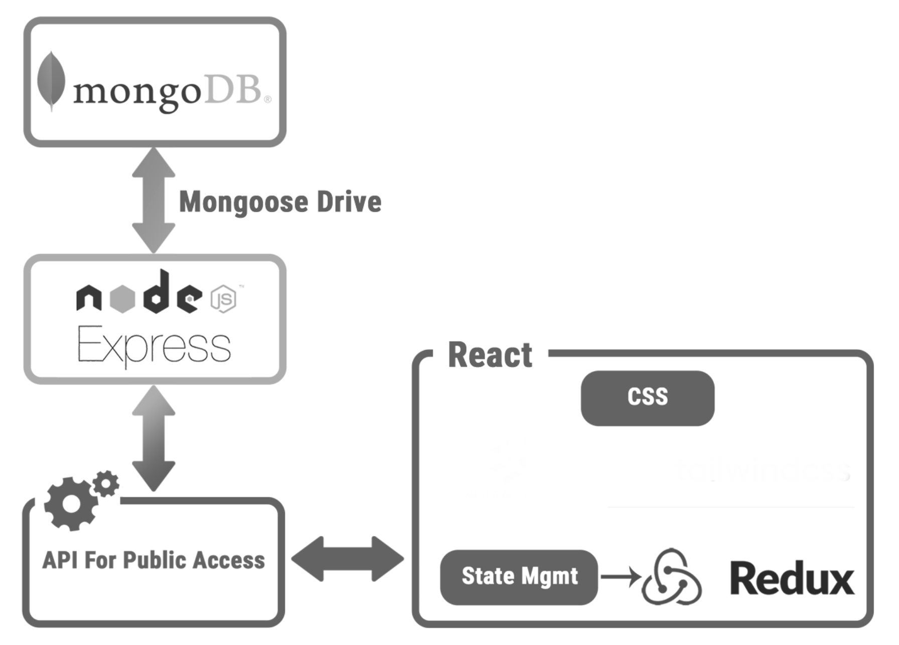

# ePet Shop - MERN full stack app

## User Story:

As a pet owner, I want to discover and shop pet products for healthcare, food and others related to dogs and cats.
As a pet products retailer, I want to create a product items and publish catelog in the site with instock quantity, price and location.

Hosted Url: https://epetshop-app.herokuapp.com/

## Objective:

Objective of the project is to develop full stack MERN website to sell the pet products for Pet lovers called "ePet Shop". This website serves petshop owners to publish their catalog products and pricing details. And pet owners can discover and buy the products, add to cart, and checkout for payment & shipping.

## USP:

We can offer same day door-to-door delivery!

## Features:

- Petshop owners should be able to create ITEMS/ Products, product images, pricing
- Login Account serving the need for Petshop owners / seller
- Login Account serving the need for petowners / buyers
- Petowners should be able to search and select an item with quantity and add to Cart feature
- Sort feature to sort by newest (date added) or sort by price

### Future Roadmap:

- Customer support (help page with support and contact details)
- 3rd party authentication with Google / Facebook
- Add profile image for seller and buyer in login information

## Architecture:

## Usage:

On the main search bar, the user can type in the company name they want to learn about and hit the Search button.

The region will be the default value which is US, the default language is English.

The website will return a maximum of 6 news article related to the company on the left, company's statistics on the right side and a chart of the company's stock price.

The data is retrieved from Yahoo Finance API, Yahoo Finance API is a reliable source of stock market data. It also provides other financial information including market summaries, historical quotes, news feed and financial reports.

### Demo

## Code Contributors:

- Deenu Yadav
- Paulo H Correa
- Stefan Salituro
- Robin Swalm
